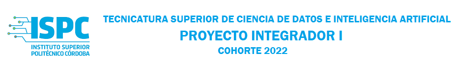

# GDEF3

### Profesores:
- Silvia Perotti
- Héctor Prado

### Integrantes:
- [Shirley Luz Frassa](https://github.com/sfrassa)
- [Virginia Díaz](https://github.com/VirginiaDi)

  
## Trello
- https://trello.com/b/4vQZ56ZJ/gdef3

## Video Presentación Trabajo Final
- [Video](presentacion-tf.mp4)

## Informe
- [Informe final](Informe de Contenido.pdf)

  
## Objetivos
- Comparar de forma rápida los precios, marcas y tamaños de pañales que se publican en el sitio web "FarmaOnline". Asimismo, y como práctica adjunta, se comparan marcas, tipos, y precios de pañales provenientes del sitio web "Farmacity".
- Obtener, modificar, y eliminar datos.
- Visualizar gráficas comparativas con los datos obtenidos del sitio web "FarmaOnline".
- Informe final de todo el contenido.

  
## Tecnologías 👩‍💻👨🏼‍💻

### Lenguajes
- Python

### Librerias
- Beautiful Soup: para Web Scrapping.
- Pandas: para guardar datos obtenidos en formato .csv
- Request: obtener el contenido de una página web.

